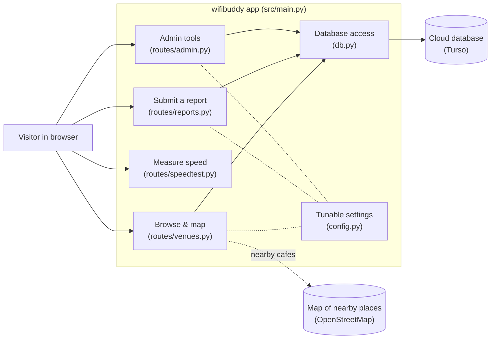
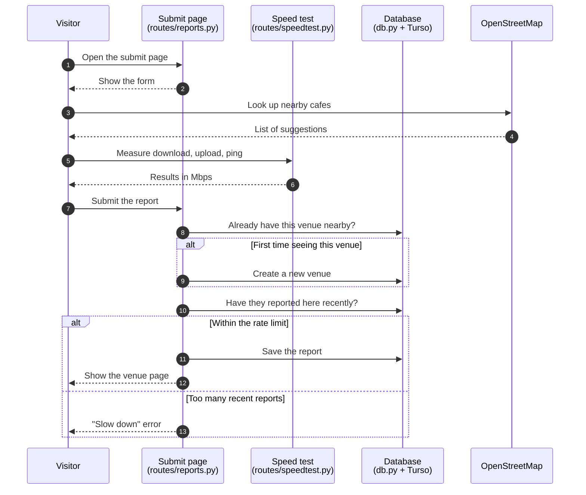
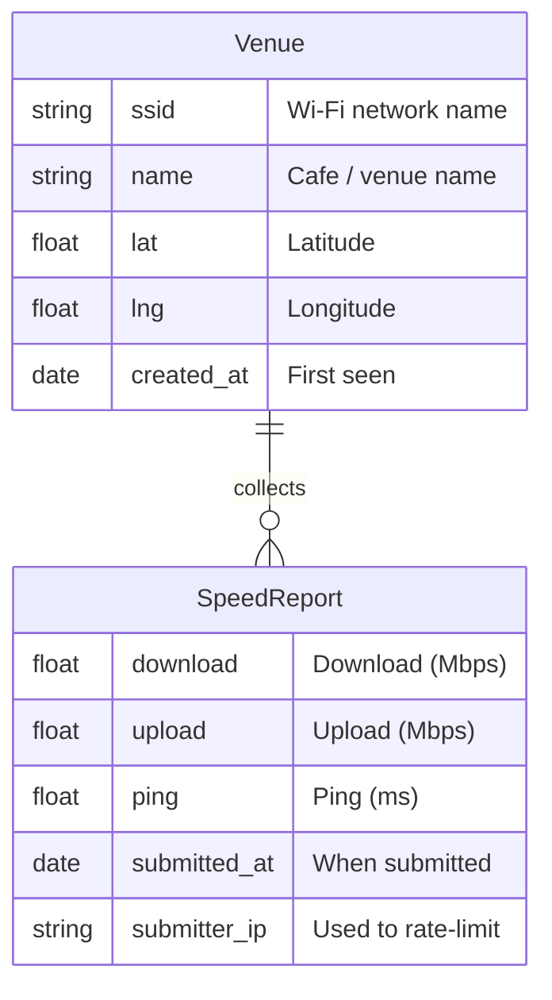

# wifibuddy

A community-tracked database of Wi-Fi speeds at public cafes and venues. Users submit speed-test results from their browser; the app deduplicates by SSID + location, aggregates medians, and surfaces a ranked list and map of nearby venues.

**Stack:** FastAPI · Jinja2 · libsql / Turso · Vercel serverless

---

## Table of contents

- [Quick start](#quick-start)
- [Architecture](#architecture)
- [Request flow](#request-flow)
- [Data model](#data-model)
- [Project layout](#project-layout)
- [Configuration](#configuration)
- [Deployment](#deployment)
- [Development](#development)

---

## Quick start

```bash
./run.sh
```

That creates a virtualenv, installs deps, runs the test suite, and starts the dev server at <http://127.0.0.1:8000>. By default it uses a local libsql file db at `./wifibuddy.local.db` (created on first run).

To run against a real Turso database instead, export credentials first:

```bash
export TURSO_DATABASE_URL="libsql://<your-db>.turso.io"
export TURSO_AUTH_TOKEN="<token from `turso db tokens create`>"
./run.sh
```

See `./run.sh --help` for flag options.

---

## Architecture



**Core pieces**

- **`src/main.py`** — FastAPI entry point. Mounts static files, wires up the four routers, calls `db.init_db()` on lifespan startup.
- **`src/db.py`** — Async libsql client wrapper. Creates schema on startup; provides `get_client()` context manager, plus helpers for venue dedupe (Haversine), rate-limit counts, and median stats. Rewrites `libsql://` URLs to `https://` so the client uses the HTTP transport (required by Vercel serverless, which does not support WebSocket connections).
- **`src/config.py`** — Tunable constants: speed thresholds (10 Mbps slow / 50 Mbps fast), pagination size (5), dedupe radius (50 m), rate-limit window (1 hour), nearby-place search radius, and admin credentials (`ADMIN_USERNAME` / `ADMIN_PASSWORD`).
- **`src/routes/`** — One module per concern (see flow below).
- **`src/templates/`** — Jinja2 HTML (`base.html`, `index.html`, `index_list.html`, `index_map.html`, `submit.html`, `venue.html`, `404.html`).

---

## Request flow

What happens when someone submits a speed report:



Browsing and admin flows are simpler: the home page lists venues sorted by median download speed; admin actions require a password (HTTP Basic).

---

## Data model

Two things get stored, defined in `src/db.py`:



A venue can have many reports — the app shows the **median** of those reports as the venue's speed. The schema is created automatically on first run.

---

## Project layout

```
wifibuddy/
├── src/
│   ├── main.py            # FastAPI app, lifespan init_db
│   ├── db.py              # libsql async client + helpers
│   ├── config.py          # thresholds, radii, admin creds
│   ├── routes/
│   │   ├── venues.py      # GET /, GET /venue/{id}, GET /api/nearby
│   │   ├── reports.py     # GET /submit, POST /reports
│   │   ├── admin.py       # DELETE /admin/reports|venues/{id}
│   │   └── speedtest.py   # /api/speedtest/{ping,download,upload}
│   ├── templates/         # Jinja2 HTML
│   └── static/            # CSS/JS assets
├── tests/                 # pytest suite (45 tests)
│   ├── conftest.py        # tmpdir file: db + TestClient fixtures
│   ├── test_db.py
│   ├── test_venues.py
│   ├── test_reports.py
│   └── test_admin.py
├── specs/                 # spec-first feature docs (see CLAUDE.md)
├── archive/               # legacy Fly.io + Docker configs, old local db
├── vercel.json            # Vercel build + routing
├── requirements.txt
├── run.sh                 # local dev runner
└── pytest.ini
```

---

## Configuration

| Variable             | Required | Notes                                                                             |
| -------------------- | -------- | --------------------------------------------------------------------------------- |
| `TURSO_DATABASE_URL` | yes      | `libsql://…` or `https://…` for Turso; `file:./path.db` for local libsql file mode |
| `TURSO_AUTH_TOKEN`   | prod     | Generated via `turso db tokens create <db>`; unused for `file:` URLs              |
| `ADMIN_USERNAME`     | yes      | HTTP Basic user for `/admin/*` endpoints (default `admin`)                        |
| `ADMIN_PASSWORD`     | yes      | HTTP Basic password (default `changeme` — override in any non-toy environment)    |

Tunable constants live in `src/config.py` (speed thresholds, pagination size, dedupe radius, rate-limit window, nearby-place search radius).

---

## Deployment

**Vercel + Turso.** `vercel.json` builds `src/main.py` with `@vercel/python` and routes all traffic to the FastAPI app. Set the four env vars above in **Vercel project Settings → Environment Variables** (project-scoped, not team-shared). A push to `main` triggers an automatic redeploy.

> Note on transport: Vercel serverless functions cannot keep WebSocket connections open, so `db.py` rewrites `libsql://` URLs to `https://` to force libsql's HTTP transport. You can store the URL in either form.

Older Fly.io / Docker deployment configs are preserved under `archive/fly-deploy/` for reference; they're no longer wired into CI.

---

## Development

```bash
# Run tests
./run.sh --skip-install --no-server      # or: pytest -q

# Server only (skip venv setup, tests)
./run.sh --skip-venv --skip-install --skip-tests

# Bind to LAN
./run.sh --host 0.0.0.0 --port 8000
```

Tests use a per-test temporary libsql file db (`tests/conftest.py` overrides `TURSO_DATABASE_URL` via `monkeypatch`), so they don't touch your real Turso instance.

All features are spec-first — see `specs/TEMPLATE.md` and the existing specs (`browse-venues.md`, `submit-speed.md`, `admin-api.md`, `data-model.md`, etc.). See `CLAUDE.md` for the full workflow.
